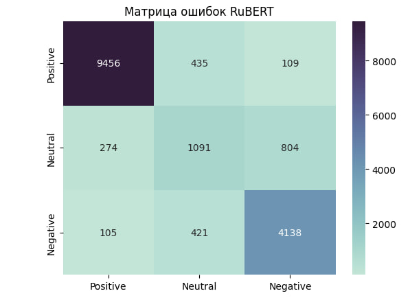

# Backend API Recifra (Сервис для классификации отзывов клиентов)
**Стек:** *Python 3.11, FastAPI, torch, transformers, peft (LoRA), pydantic, uvicorn*  
**CI/CD-стек**: *git, docker*

## Системные требования

| Параметр | Минимум                            | Рекомендуется                      |
|----------|------------------------------------|-------------------------------------|
| ОС | Windows 10, macOS 11, Ubuntu 20.04 | Windows 11, macOS 13, Ubuntu 22.04 |
| RAM | 4 GB                                | 8 GB+                                |
| Диск | 5 GB свободного места              | 10 GB+                              |

---

## Установка и запуск

### Шаг 1 - Клонирование репозитория

Склонируйте репозиторий к себе на локальную машину:
```bash
git clone https://github.com/Jeson3532/recifraTask.git
```
Перейдите в директорию с проектом:
```bash
cd recifraTask
```

---

### Шаг 2 - Установите Docker Desktop

Скачайте и установите Docker Desktop по инструкции: https://www.docker.com/products/docker-desktop/
Проверьте успешную установку:

```bash
docker --version
```

Если выводится версия - всё OK.

---

### Шаг 3 - Установите WSL *(только для Windows)*

Откройте терминал от имени администратора и выполните:

```bash
wsl --install
```

После установки потребуется перезагрузка компьютера.

---

### Шаг 4 - Создайте файл ".env" в корне проекта

Требуется создать .env-файл в корне проекта (папка recifraTask):
```env
# Секретный ключ для доступа к API
SECRET_KEY=YOUR_SECRET
```

> Если переменная `SECRET_KEY` не задана, все энд-поинты, требующие авторизации, будут недоступны (сервер вернёт ошибку 500).

---

### Шаг 5 - Добавьте файлы ML-модели в папку static/bert

Выдаются разработчиком отдельно, файлы имеют архитектуру BERT и используются для анализа тональности текста.

---

### Шаг 6 - Запустите Docker Desktop

Убедитесь, что Docker Desktop запущен перед следующим шагом.

---

### Шаг 7 - Соберите и запустите контейнер

Находясь в корне проекта, выполните:

```bash
docker compose up -d --build
```

> **Первая сборка может занять 10–20 минут** - скачиваются образы и зависимости (torch, transformers и т. д.). При первом запуске контейнера также будет скачана базовая модель `DeepPavlov/rubert-base-cased-conversational` с HF Hub.

Проверить статус контейнера:

```bash
docker ps
```

Либо откройте **Docker Desktop** и убедитесь, что контейнер `backend-main` в статусе `Running`.

---

### Шаг 7 - Откройте документацию API

| Интерфейс | Адрес |
|-----------|-------|
| Swagger UI | http://localhost:8000/docs |
| ReDoc | http://localhost:8000/redoc |

---

## Использование

1. Откройте **Swagger UI** или **ReDoc**
2. Выберите нужный энд-поинт
3. Нажмите **"Try it out"**
4. В заголовок `secret_key` укажите значение, заданное в переменной `SECRET_KEY` из `.env`
5. Заполните параметры и нажмите **"Execute"**
6. Ознакомьтесь с ответом в разделе **Responses**

---

## Остановка

Чтобы остановить контейнер:

```bash
docker compose down
```

---

## Описание структуры проекта
```bash
recifraTask
├── .env
├── .gitignore
├── .dockerignore
├── Dockerfile
├── docker-compose.yaml
├── requirements.txt
├── static/
│   ├── bert/                  
│   └── files/                 
└── backend/
    ├── __init__.py
    ├── entry.py
    ├── exc.py
    ├── dependencies/
    │   ├── security.py
    │   └── state.py
    ├── routes/
    │   ├── __init__.py
    │   └── model.py
    ├── schemas/
    │   └── model/
    │       ├── request.py
    │       └── response.py
    ├── services/
    │   └── ml/
    │       └── engine.py
    └── utils/
        └── enums.py
```

### Описание модулей
**BACKEND:**
- `backend/entry.py` - точка входа для FastAPI, регистрация роутеров, управление жизненным циклом (загрузка и warmup ML-модели)
- `backend/exc.py` - объединённый setup отлова ошибок авторизации на уровне FastAPI
- `backend/dependencies/` - функции для Depend-инъекции (проверка секретного ключа, доступ к состоянию приложения/модели)
- `backend/routes/` - директория со всеми роутерами.

**SERVICES:**
- `backend/services/ml/engine.py` - сервис-обёртка над ML-моделью. Здесь загрузка базовой модели и LoRA-адаптера, выбор устройства (CPU/CUDA/MPS), прогрев и инференс

**OTHER:**
- `backend/schemas/` - Pydantic-схемы для валидации запросов и ответов
- `backend/utils/enums.py` - enums проекта
- `static/bert/` - веса LoRA-адаптера, конфигурация и токенизатор
- `static/files/` - вспомогательные материалы, прочие файлы

### Текущий функционал
- Классификация текста отзыва по категории (`resolved` / `basic` / `complaint`)
- Определение приоритета обращения (`low` / `medium` / `high`) на основе категории
- Возврат уверенности модели (`confidence`) и распределения вероятностей по классам (`probabilities`)
- Валидация входного текста (минимальная длина, отсеивание текста без слов и эмодзи)
- Авторизация энд-поинтов по секретному ключу через заголовок `secret_key`
- Автоматический выбор устройства для инференса (CPU / CUDA / MPS)
- Прогрев модели при старте приложения для ускорения первого реального запроса

### Используемая ML-модель
**Базовая модель**: *DeepPavlov/rubert-base-cased-conversational*
**Метод адаптации**: *LoRA (PEFT), r=16, alpha=24*
**Задача**: *SEQ_CLS (классификация последовательностей), 3 класса (negative/positive/neutral)*
**Фиксированный язык**: *ru*
**Device**: *Auto*

### Ограничения текущего MVP
- Единственный энд-поинт классификации, без хранения истории обращений и без базы данных
- Авторизация реализована через один статический секретный ключ (без пользователей, ролей и JWT-пайплайна)
- Базовая модель скачивается с HF Hub при первом запуске контейнера, можно загрузить локально
- Нет фронтенд-части - доступ к сервису только через API (Swagger/ReDoc или прямые запросы)

### Список энд-поинтов

#### ML-модели (`/models`)

| Метод | Путь                          | Описание                                                       |
|-------|-------------------------------|-----------------------------------------------------------------|
| POST  | /models/review-classifier     | Классификация текста отзыва |

## Возможные проблемы

### Порт 8000 уже занят

Найдите процесс, занимающий порт, и завершите его:

```bash
# Windows
netstat -ano | findstr :8000

# macOS / Linux
lsof -i :8000
```

Либо измените порт в `docker-compose.yaml` (например, `8001:8000`).

---

### Контейнер не запускается

Посмотрите логи для диагностики ошибки:

```bash
docker compose logs -f
```

---

### Ошибка 500 при обращении к энд-поинту

Скорее всего, в `.env` не задана переменная `SECRET_KEY`. Проверьте наличие файла `.env` в корне проекта и перезапустите контейнер:

```bash
docker compose up -d --build
```

---

### Ошибка 403 "Доступ запрещен, введен неверный ключ"

Проверьте, что значение заголовка `secret_key` в запросе совпадает со значением `SECRET_KEY` из `.env`.

---

### Недостаточно памяти

Откройте **Docker Desktop → Settings → Resources** и увеличьте лимит RAM до 4 GB+.

---

### WSL не установлен *(Windows)*

Убедитесь, что терминал запущен **от имени администратора**, и повторите:

```bash
wsl --install
```

---

### Не удаётся скачать базовую модель при первом запуске

Убедитесь, что у контейнера есть доступ в интернет (для скачивания `DeepPavlov/rubert-base-cased-conversational` с Hugging Face Hub), и повторите сборку.


## Отчет по ML-пайплайну

### Цель этапа
Проверить несколько подходов к классификации тональности отзывов и выбрать модель для дальнейшего дообучения и использования в проде.

### Датасет
Использован датасет `geo-reviews-dataset-2023.csv` (отзывы с Яндекс.Карт). Целевая переменная - тональность, полученная агрегацией исходного рейтинга (0–5) в 3 класса:
- `0–2` -> **negative**
- `3` -> **neutral**
- `4–5` -> **positive**

Классы в датасете несбалансированы (положительных отзывов существенно больше), поэтому далее везде считается **macro-average** по метрикам.

### Предобработка
Применялись два разных пайплайна в зависимости от типа модели:
- **Для классических ML-моделей (RandomForest, CatBoost):** очистка текста от лишних символов и цифр, удаление стоп-слов (nltk), лемматизация (`pymorphy3`), векторизация через **TF-IDF** (до 10 000 признаков, n-граммы 1–2).
- **Для нейросетевых архитектур (BERT-based):** текст подавался в исходном виде без очистки/лемматизации - предобработка только ухудшает качество моделей, использующих MLP-компоненты (трансформеры), поскольку разрушает естественную структуру языка, на которой они предобучены.

Для классических моделей из-за ограниченных ресурсов использовались сбалансированные подвыборки (10 000–20 000 примеров на класс), для трансформеров - понижение мажоритарного класса до 100 000 записей.

### Рассмотренные подходы и результаты

| Подход | F1 (macro) | Precision (macro) | Recall (macro) | Accuracy |
|---|---|---|---|---|
| RandomForest (ансамбль деревьев, TF-IDF) | 0.69 | 0.69 | 0.69 | - |
| CatBoost (градиентный бустинг, TF-IDF) | 0.6386 | 0.6223 | 0.7473 | - |
| BERT №1 - `ai-forever/ruBert-base` | 0.7332 | 0.7630 | 0.7187 | 0.9450 |
| **BERT №2 - `DeepPavlov/rubert-base-cased-conversational`** | **0.7784** | 0.7803 | 0.7786 | 0.8664 |

Обучение трансформеров велось с LoRA-адаптером (PEFT, `r=16`, `alpha=24`, `dropout=0.1`, таргет-модули `query/key/value/dense`, `task_type=SEQ_CLS`) и кастомным `FocalLossTrainer` (focal loss, `gamma=2.0`) для смягчения дисбаланса классов. Классические модели (RandomForest, CatBoost) настраивались через `RandomizedSearchCV`/явные гиперпараметры с `class_weight='balanced'`.

### Выбор модели
Обе BERT-архитектуры показали сопоставимые базовые характеристики, но **DeepPavlov/rubert-base-cased-conversational** дал результат на **5–7% лучше** по основной метрике (F1-macro) за счёт того, что предобучался на неформальных диалогах (соцсети, комментарии, отзывы), что по стилю ближе к целевым данным. Именно эта модель выбрана для использования на проде (используется LoRA-адаптер поверх неё, см. `static/bert/`).

В ходе анализа матрицы ошибок выбранной модели было выявлено, что текущая реализация имеет проблемы с различием негативных и нейтральных отзывов (цифра 804 на диаграмме) В дальнейшем это лечится расширением выборки и переходом на более сложные модели.  

### Оценка результата
Целевой ориентир по гипотезе - F1-macro в районе 0.80–0.85. Из-за дисбаланса классов и ограниченных вычислительных ресурсов достигнутые **~0.78** признаны приемлемым результатом для задачи анализа тональности в рамках MVP.

### Ограничения и дальнейшие шаги
- Текущее решение не предназначено для более глубокого анализа текста (сарказм, скрытый подтекст и т. п.) - для этого потребуется переход на vLLM и large-модели (16–35B параметров), что требует значительно большего объёма видеопамяти.
- Для анализа текстов с эмодзи и глубоким смыслом в дальнейшем требуется расширить выборку, это даст прирост от 5% до 15%.